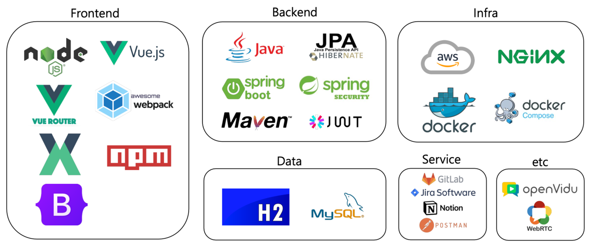
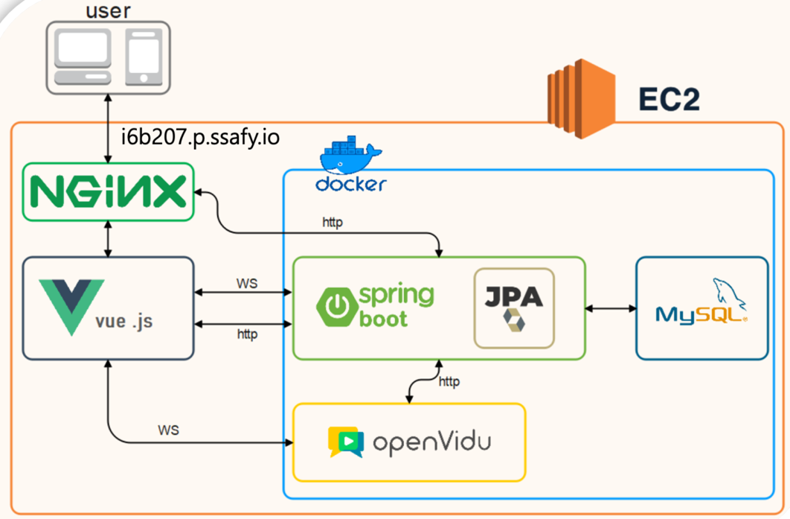

# :video_camera: VIBID :chart_with_upwards_trend:

<div align=center>   

<h3>당신의 가치를 더욱 가치있게<h3>
<h6>Video  Bid =  VIBID</h6>
</div>

## :pushpin: 프로젝트 소개
---
`VIBID`는 영상을 뜻하는 `Video`와 경매를 뜻하는 `Bid`의 합성어입니다.
우리가 만든 소중한 창작물들에게 좋은 주인을 찾아주세요 :heart:

판매자에게는 자신의 물품의 가치를 구매자에게는 실시간 영상 통신으로 물건을 확인할 수 있는 안정감을 제공해드립니다.

## :open_file_folder: WIKI
---
<div align=center>
<a href="https://adjoining-tarragon-87a.notion.site/VIBID-de025f8feec3477cba76aed21fff2ce8">팀 노션</a>　|　
<a href="https://adjoining-tarragon-87a.notion.site/76d0fc7737b848cb9c8347aa5ae504e0"> 회의록</a>　|　
<a href="https://documenter.getpostman.com/view/11823464/UVXkma8n"> API 명세서</a>　|　
<a href="https://www.erdcloud.com/d/akr3ddGtWnTrfRv2Q"> ERD </a>　|　
<a href="https://www.figma.com/file/8rjfth2PuFWq5b6oNa5g9S/ssafy_project?node-id=3%3A193136"> FIGMA </a>
</div>

## :pushpin: 기술스택
---

<div align=left>
<table>
    <tr>
        <td><b>Back-end</td>
        <td>


<br>


<br>


</td>
    </tr>
    <tr>
    <td><b>Front-end</td>
    <td>
    
    
    
    <br>
    
    
    
    </td>
    </tr>
    <tr>
    <td><b>Tools</td>
    <td>


</td>
    </tr>
</table>
<div>

## :pushpin: 서버 아키텍처
---


## :pushpin: 서버 환경 설정
---
**시스템 환경 AWS EC2 : Ubuntu 20.04**

- Java install
    ```bash
    sudo apt update
    sudo apt install openjdk-11-jdk
    java -version
    ```
- Maven install
    - 최신 버전
        ```bash 
        sudo apt update
        sudo apt install maven
        mvn -version
        ```
    - 버전 선택
        ```bash
        cd /tmp
        wget https://archive.apache.org/dist/maven/maven-3/3.6.3/binaries/apache-maven-3.6.3-bin.tar.gz

        # 아래 명령어 입력하면 비밀번호 요구
        sudo tar xf /tmp/apache-maven-*.tar.gz -C /opt
        sudo ln -s /opt/apache-maven-3.6.3 /opt/maven

        ## 환경 설정
        sudo nano /etc/profile.d/maven.sh

        ## 아래 내용 붙여넣고 파일 저장 
        export JAVA_HOME=/usr/lib/jvm/default-java
        export M2_HOME=/opt/maven
        export MAVEN_HOME=/opt/maven
        export PATH=${M2_HOME}/bin:${PATH}

        sudo chmod +x /etc/profile.d/maven.sh
        source /etc/profile.d/maven.sh

        $ mvn -version
        ```
- Docker install
    ```bash
    sudo apt-get update && apt-get upgrade

    sudo apt-get install \
        apt-transport-https \
        ca-certificates \
        curl \ 
        gnupg \ 
        lsb-release

    curl -fsSL https://download.docker.com/linux/ubuntu/gpg | sudo gpg --dearmor -o /usr/share/keyrings/docker-archive-keyring.gpg

    echo \
        "deb [arch=$(dpkg --print-architecture) signed-by=/usr/share/keyrings/docker-archive-keyring.gpg] https://download.docker.com/linux/ubuntu \
        $(lsb_release -cs) stable" | sudo tee /etc/apt/sources.list.d/docker.list > /dev/null

    sudo apt-get update
    sudo apt-get install docker-ce docker-ce-cli containerd.io
    ```

- Docker-compose install
    ```bash
    sudo curl -L "https://github.com/docker/compose/releases/download/1.29.2/docker-compose-$(uname -s)-$(uname -m)" -o /usr/local/bin/docker-compose

    sudo chmod +x /usr/local/bin/docker-compose 
    ```

- letsencrypt https 발급   
    - NGINX 사용중이면 종료 필수 (80번 포트 사용)
    ```bash
    sudo certbot certonly --standalone
    ---
    (Y)es/(N)o: Y <- ACME 약관에 동의하는지 N선택시 진행불가
    ---
    (Y)es/(N)o: N <- 이메일을 통해 Lets Encrypt 프로젝트 정보를 받아볼지
    ---
    Please enter in your domain name(s) (comma and/or space separated)
    (Enter 'c' to cancel) : i6b207.p.ssafy.io  <- {1} 인증서를 발급할 도메인 입력
    ---
    /etc/letsencrypt/live/i6b207.p.ssafy.io/ 에 인증키 생성
    ```

- MySQL 설치
    [링크](https://delirious-ankle-691.notion.site/DB-convention-eb6959018d894add974e44ee40c03df9)
- Openvidu 설치 
    - port : 4443

- NGINX 설치
    ```bash
    sudo apt-get update && apt-get upgrade
    sudo apt-get install nginx

    cd /etc/nginx/sites-available
    sudo vi default
    ```
    ```vi
    server {
            listen 80;
            listen [::]:80;
            server_name i6b207.p.safy.io;
            return 301 https://$server_name$request_uri;
    }

    server {
            listen 443 ssl default_server;
            listen [::]:443 ssal default_server;

            root /var/www/html/dist;
            
            index index.html index.htm;
            server_name i6b207.p.ssafy.io;

            ssl_certificate /etc/letsencrypt/live/i6b207.p.ssafy.io/fullchain.pem;
            ssl_certificate_key /etc/letsencrypt/live/i6b207.p.ssafy.io/privkey.pem;

            location / {
                    try_files $uri $uri/ /index.html;
            }

            location /api {
                    proxy_pass http://localhost:8080/;
                    proxy_http_version 1.1;
                    proxy_set_header Connection "";
                    proxy_redirect off;
                    charset utf-8;

                    proxy_set_header Host host;
                    proxy_set_header X-Real-IP $remote_addr;
                    proxy_set_header X-Forwarded-For $proxy_add_x_forwarded_for;
                    proxy_set_header X-Forwarded-Proto $scheme;
                    proxy_set_header X-Forwarded-Host $host;
                    proxy_set_header X-Forwarded-Post $server_port;
                    proxy_set_header X-NginX-Proxy true;
            }
    }
    ```
    ```bash
    sudo service nginx start
    ```

- 배포
    ```bash
    git clone https://lab.ssafy.com/s06-webmobile1-sub2/S06P12B207.git vibid

    # backend

    cd backend
    ./mvnw clean package
    sudo docker-compose up --build -d

    # frontend
    cd ../frontend
    npm install
    npm run build
    ```
    - Dockerfile
        ```shell
        FROM openjdk:11-jdk
        ARG JAR_FILE=target/*.jar
        COPY ${JAR_FILE} app.jar
        EXPOSE 8080
        CMD ["./mvnw", "clean", "package"]

        ENTRYPOINT ["java", "-jar","-Duser.timezone=Asia/Seoul", "./app.jar"]
        ```
    - docker-compose.yml
        ```shell
        version: "3.8"

        services:
        boot-db:
            image: mysql:5.7.35
            restart: always
            environment:
            - MYSQL_ROOT_PASSWORD=ssafy
            - MYSQL_DATABASE=vibid
            - MYSQL_USER=ssafy
            - MYSQL_PASSWORD=ssafy
            ports:
            - "17177:3306"
            command:
            - --character-set-server=utf8mb4
            - --collation-server=utf8mb4_unicode_ci
            volumes:
            - ./db:/var/lib/mysql
            networks:
            - springboot-mysql-net
        
        spring-boot:
            build: .
            ports:
            - 8080:8080
            depends_on:
            - boot-db
            volumes:
            - ./imgs:/imgs
            - ./fwords:/fwords
            environment:
            - SPRING_DATASOURCE_URL=jdbc:mysql://boot-db:3306/vibid?useSSL=false&serverTimezone=UTC&autoReconnect=true
            - SPRING_DATASOURCE_USERNAME=ssafy
            - SPRING_DATASOURCE_PASSWORD=ssafy
            networks:
            - springboot-mysql-net

        networks:
        springboot-mysql-net:

        ```
